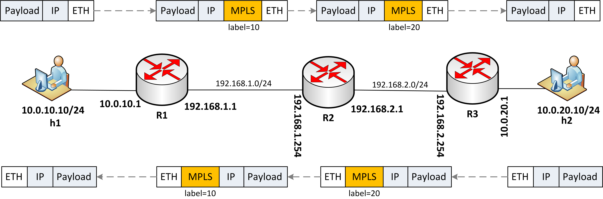

## GTP Example ##
To make testing easier, we created example environment that's easier to manage than our main test case, by modyfying MPLS Demo we found in P4 Research repository (even this readme is based on it). Because of that topology is exactly the same:

  

##State of the project##
Right now, based on Wireshark readings, we can either ping using only ip (nothing to be proud of, because it doesn't use anything from out project), or we can try to use our push_gtp function. 
Sadly, if we try to do it that way, there is "Ethernet Frame Check Incorrect" error, and ping doesn't return, despite the fact that packet gets to s3-eth1. Error is most probably in our code, or in switch routing settings.

### User guide ###

1. First of all you need to setup the environment on your Linux machine.
2. From gtp-test/ directory run the Mininet topology with MPLS program.

`sudo python topo.py --behavioral-exe simple_switch --json p4include/gtp_p16.json`

4. In the Mininet console, check if ping between h1 and h2 works (it shouldn't!).

`h1 ping h2`

5. As expected ping doesn't work, because the static rules weren't populated by control plane. Populate static rules manually by invoking:

`./install_flow_rules.sh`

6. Now is the part that doesn't work, if we have our push_gtp function set.

`h1 ping h2`

